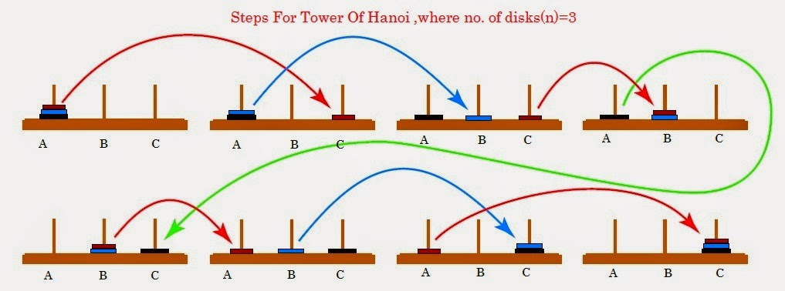

# Design of recursive algorithms
## Recursive decomposition

*In general, identifying an efficient algorithm for solving a problem requires:
* In-depth knowledge of the problem in terms of structure
* Use of various algorithm design techniques.

One of the most important and practical design techniques in the world of algorithms is the *Divide et Impera*. It's based on recursion, which, starting from a problem, identifies some problems under the same type but simpler and, if resolved, they allow to build the solution of the original problem.
Writing recursive code is simpler and more elegant because many real problems have a recursive structure.

A common definition of recursion is the following: 

*An algorithm is called recursive when in its body it recalls itself, directly or indirectly. The recursion is directed when the procedure invokes itself directly in its body, or indirect if the procedure invokes another procedure that recalls the original procedure.*

Unfortunately, the recursion formulated in this way doesn't captures the most crucial aspect: recursion, in addition to being a structural property of a procedure, it is a powerful tool for designing algorithms that, **using traditional iterative techniques, they would be difficult to formalize.** In particular, the recursive programming technique has its roots in a mathematical context,  based on the well-known principle of mathematical induction.

## Recursion and the principle of mathematical induction
Let P be a property (expressed by a sentence or a formula containing the variable n which varies on natural numbers). Suppose that:
• P (k) is true for k = 1, (Base of the induction),
• that P is true for a generic value n (Inductive Hypothesis),
• if starting from the truth of P (n) we can prove the truth of P (n + 1), then P (k) is true for any value of k

## Recursive definitions of functions
An example overused in mathematics and computer science texts, to explain the paradigm of recursion, is the factorial. I believe that this example is strongly misleading to understand the most relevant aspects of recursion: we use the factorial function to highlight what recursion is not.
Consider the following factorial function, defined as:

n! = $\prod_{i=1}^{n} i$ = 1 * 2 *···* (n - 2) * ( n- 1) * n

Through a simple demonstration, the following properties can be verified:

n! = n * (n - 1)! if n > 1

From the result, the two equations are almost equal, but the process for evaluating the two equations is entirely different.
The most significant is that the second definition defines the factorial in terms of **itself**: in many circumstances, it is more frequent to come across situations in which it is straightforward to define a problem or function in recursive terms, and it is in these cases that recursion makes evident all its expressive capacity.

## Divide et Impera


The technique of Divide and Impera, as the name suggests, consists in solving a problem using a particular subdivision of it in various sub-problems. More precisely, k sub-problems are identified initially, of the same type as the original one, but which operate on data structures of smaller dimensions.
Then the k sub-problems are solved, and their solutions are used to determine that of the original problem. The recursion is interrupted when a sub-problem reaches a dimension so small that it can be solved directly.
The design of recursive algorithms based on the divide-and-conquer technique involves the following steps:
1. **Divide**: starting from the problem to be solved on data d, we identify k problems of the same type as the original ones, but having smaller dimensions. This subdivision generally occurs by imagining the appropriate divisions of d, so simple, to know the solution, thus stopping the process of further subdivision, such cases are called base cases.
2. **Impera**: by hypothesis, we can solve each of the sub-problems in which P has been decomposed, and we know the solutions.
3. **Combine**: starting from the solutions, considered correct, of the sub-problems in which P is divided,  we build the correct solution to the problem P.
### Example the tower of Hanoi


The game consists of three pins, indicated with O (for Origin), D (for Destination) and I (stands for Intermedio), on which there are n discs of different diameters. The disks are initially arranged on the pin O with increasing order of diameter from top to bottom, and the goal is to carry out the sequence necessary to bring in the same order, all the disks in the pin D. The player can move one disk at a time by pulling it from the top of a pin and depositing it on another pin, if the pin is empty or contains a disk with a larger diameter at the top.
We indicate with HO,D(n) the problem of the Tower of Hanoi with n disks between the pin O and the pin D, using the pin I as an intermediate; we analyze how the algorithm is designed in a recursive form using the principle of Divide and Impera.

1. **Divide**: we divide the generic problem of Hanoi H(n) in Hanoi problems with n-1. This division also makes it possible to achieve, through successive reductions, the basic case represented by the problem with a single disk H(1), easily solved as it provides a single move.
2. **Basic case**: the trivial problem of Hanoi with a single disk HX,Y(1), between two generic pins X and Y, is solved by moving the disk from X to Y.
3. **Impera**:  we suppose by hypothesis how to correctly solve the same problem H(n - 1) with n-1 disks, and then the correct sequence of moves.
4. **Combine**: it is easy to verify that in the hypothesis that we know how to solve HX, Y(n - 1), the solution to HO,D(n) is given by the sequence HO,I(n-1), HO,D(1), HI,D(n-1)


*The activation diagram of the various instances of the Hanoi function. For n = 3, the solution to the Hanoi problem requires seven moves and nine recursive invocations*

This is an example in Java for n = 3:
```java
void hanoi(int n, int O, int D, int I) {
    if (n == 1)
        printf("Move the disk from - to: ", O, D);
    else {
        hanoi(n - 1, O, I, D); hanoi(1, O, D, I); hanoi(n - 1, I, D, O);
        }
    }
```
