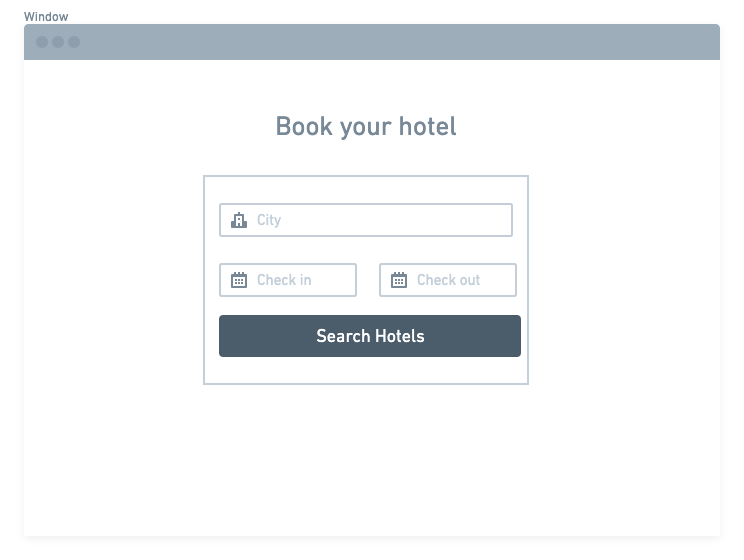
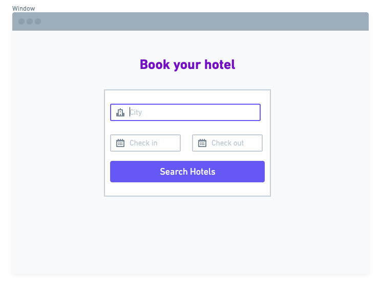

When you start the design for a new app idea, what do you design first? 
Maybe the navigation bar on the top of the page.
What color I have to use? fonts? Paddings? Margins?

In that case, you are starting off on the wrong foot.

## Start thinking about features, no the shell.

It seems like an obvious conclusion, but it's easy to fall into this trap and start to create our app from the design.

Why?

Because an App is a collection of features that interact with each other, but if you don't plan the features you cannot build a navigation.
This approach can be confusing and can direct you to unconsciously think about the details before you understand what you need to accomplish.

Let's do an example:
If you need to realize an E-commerce or an App to book hotels, probably the primary component you will build is the Search.

So the first question you have to ask to yourself is:
What my App need to do?

The second question is:
What properties my component should have?

For example my App to book hotels should have:
- A destination
- Start date
- End Date
- A button to perform search

Right? In case we build a search engine we have almost done!

## Avoid details at the beginning

Fonts, colors, icons, shadows are essential details that make the difference in your UI. However, until you don't have a clear idea of your final product, avoid that. 
Instead, try to find different solutions and see how the features can integrate with each other.

### Design in greyscale

That's pretty useful because, without color, you are forced to use spacing and contrast to do all of the heavy lifting. That's no easy, but you are obliged to create a clear UI with a strong hierarchy. Then you can enhance all with colors.

### Start with Sketches or Wireframes

Static Mockups can't do everything, especially when you need to explore ideas. In that case, Wireframes can help you in design low-fidelity

## Enhance your UI design gradually

Before starting the implementation (and even after), you don't have to design every single feature. It is a waste of time because requirements can change, or your product needs more feedback before considering edge cases. 

Typical edge cases are:

- Where I have to place error messages?
- In case I have a long list of results, which parts of the UI Should I display?
- Do we need to provide loaders for the button after clicking on it?

Focus on the main features and try to achieve them, also foreseeing future uses.

### Work with cycles: Design then code then repeat

Once your basic design is finished, start to implement it. You will probably find a lot of issues, but that's good. It's easy to fix an interface that you use, and you can start to think about edge cases.
So, back to design and fix it.
Once you solve all problems, stop to develop and back in "design mode."

### Don't predict too much

It's by far better to implement something that could work than wait to have all features to complete your design. This is especially true when your work depends on different teams with different roles.
For example, you can design a registration form that, in the future, most probably need to support uploading for avatars.
If Apis to support this feature are not ready yet, don't add it to the design.
Another example could be the possibility of adding an IntelliSense to the Search input.
Keep simple the interface to the early stage, then improve it.

## Be systematic in your choices

When you’re designing without constraints, decision-making is torture because there’s always going to be more than one right choice.
Having millions of colors and thousands of fonts to choose from might sound nice in theory, but in practice it’s usually a paralyzing curse.

### Define your general layout
You cant' pick up 50 colors. Try to limit your choice between 5 or 6 of them as standard rules. It'll save you a ton of decision fatigue down the road.
Material design offers a great tool to help you:

https://material.io/resources/color/#!/?view.left=0&view.right=0&primary.color=F4511E&secondary.color=FFA726

You should try to systemize as much you can to approaching design with a system-focused mindset.
- font
- color
- border
- margin & padding
- opacity
- size (width & height)
- box shadow
- borders