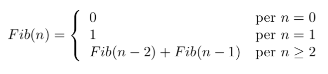

# Design of recursive algorithms.
## Recursive decomposition

In general, an efficient algorithm to solve a problem requires:
* In-depth knowledge of the problem in terms of structure
* Use of various algorithm design techniques.

One of the most important and practical design techniques is the *Divide et Impera*. It's based on recursion, which, starting from a problem, identifies some problems under the same type but simpler and, if resolved, they allow to build the solution of the original problem.
For us, writing recursive code is simpler and more elegant because many real problems have a recursive structure.

A common definition of recursion is the following: 

*An algorithm is recursive when in its body recalls itself, directly or indirectly. The recursion is called direct when the procedure invokes itself directly in its body, or indirect if the procedure invokes another procedure that recalls the original procedure.*

Unfortunately, the recursion formulated in this way doesn't captures the most crucial aspect: recursion, in addition to being a structural property of a procedure,it's a powerful tool for designing algorithms that, **using traditional iterative techniques, they would be difficult to formalize.** In particular, the recursive programming technique has its roots in a mathematical context,  based on the well-known principle of mathematical induction.

## Recursion and the principle of mathematical induction
Let P be a property (expressed by a sentence or a formula containing the variable n which varies on natural numbers). Suppose that:

* P (k) is true for k = 1, (Base of the induction).
* that P is true for a generic value n (Inductive Hypothesis).
* if starting from the truth of P (n) we can prove the truth of P (n + 1), then P (k) is true for any value of k.

## Recursive definitions of functions
An example in Math and Computer Science texts, to explain the paradigm of recursion,is the Factorial. This example is strongly misleading because it hides the most relevant aspects of recursion, so we use the factorial function to highlight what recursion is not.

Consider the following factorial function, defined as:


Through a simple demonstration, the following properties can be verified:

n! = n * (n - 1)! if n > 1

From the point of view of the result, the two equations are equals, but the process for evaluating them is entirely different.
The most significant difference is that the second definition defines the factorial in terms of **itself**: in many circumstances, it is more frequent to come across situations in which it's natural to define a problem or function in recursive terms, and it is in these cases that recursion makes evident all its expressive capacity.

## Divide et Impera


The technique of Divide and Impera, as the name suggests, consists in solving a problem using a particular subdivision of itself in various sub-problems. More precisely, k sub-problems are initially identified, similar the original one, but which operate on data structures of smaller dimensions.
Then the k sub-problems are solved, and their solutions are used to solve the original problem. The recursion is interrupted when a sub-problem reaches a dimension so small that it can be solved directly.
The design of recursive algorithms based on the Divide et Impera technique involves the following steps:
1. **Divide**: starting from the problem to be solved on data *d*, we identify k problems of the same type as the original ones, but having smaller dimensions. This subdivision generally occurs by imagining the appropriate divisions of *d*, so simple, to know the solution, thus stopping the process of further sub-division, such cases are called base cases.
2. **Impera**: by hypothesis, we can solve each of the sub-problems in which P has been decomposed, and we know the solutions.
3. **Combine**: starting from the solutions(considered correct by hypothesis), of the sub-problems in which P is divided,  we build the correct solution to the problem P.
### Example: the tower of Hanoi


This puzzle game consists of three rods, indicated with O (for Origin), D (for Destination) and I (stands for Intermedio), on which there are n disks of different sizes. The disks are initially arranged on the rod O with increasing order of diameter from top to bottom, and the goal is to carry out the sequence necessary to bring in the same order, all the disks in the rod D. The player can move one disk at a time by pulling it from the top of a rod and depositing it on another rod, if the rod is empty or contains a disk with a larger diameter at the top.
We indicate with HO,D(n) the problem of the Tower of Hanoi with n disks between the rod O and the rod D, using the rod I as an intermediate; we analyze how the algorithm is designed in a recursive form using the principle of Divide and Impera.

1. **Divide**: we divide the generic problem of Hanoi H(n) in Hanoi problems with n-1. This division also makes it possible to achieve, through successive reductions, the basic case represented by the problem with a single disk H(1), easily solved as it provides a single move.
2. **Basic case**: the trivial problem of Hanoi with a single disk HX,Y(1), between two generic rods X and Y, is solved by moving the disk from X to Y.
3. **Impera**:  we suppose by hypothesis how to correctly solve the same problem H(n - 1) with n-1 disks, and then the correct sequence of moves.
4. **Combine**: it is easy to verify that in the hypothesis that we know how to solve HX, Y(n - 1), the solution to HO,D(n) is given by the sequence HO,I(n-1), HO,D(1), HI,D(n-1)


*The activation diagram of the various instances of the Hanoi function. For n = 3, the solution for the Hanoi problem requires seven moves and nine recursive invocations*

```c
void hanoi(int n, int O, int D, int I) {
    if (n == 1)
        printf("Move the disk from - to: ", O, D);
    else {
        hanoi(n - 1, O, I, D); hanoi(1, O, D, I); hanoi(n - 1, I, D, O);
        }
    }
```
## Classification of recursive algorithms
Based on the number of recursive calls present in an algorithm and their position in the code, we can articulate a useful classification in the following categories:

* Linear recursion
* Multiple Recursion
* Mutual Recursion
* Nested Recursion

Each of these categories has some common characteristics that are worth highlighting. Moreover, the Linear and Multiple recursion cases have an important structural feature, which makes the recursive algorithm naturally transformable into an iterative algorithm: **tail recursion**.
A recursive algorithm is called tail recursion if the recursive call is the last instruction of the algorithm itself.

### Linear recursion
We can say that an algorithm is linear recursive if in its body it is present a single call to itself.
A classic example is the recursive version of the factorial

```c
long factorial(int n) {
    /* base case */
    if(n == 0)
        return 1
    else
        /* divide, impera and combine */
        return factorial(n - 1) * n
}
```

Note that the factorial function is not a tail recursion because the recursive call is not the last action performed by the function itself: even if you exchange terms we need to perform a product.

An example of linear tail recursion is represented by the binary search of an element in an ordered vector (Dichotomic or Binary search). Applying the technique of Divide et Impera we have:

1. **Divide**: It is supposed to divide the input vector, containing n elements in two parts, the one containing the elements from position 1 to position n / 2 - 1 and the one containing elements from n / 2 + 1 to n.
2. **Trivial case**: There are two trivial cases: when the element in the central position of the vector (n / 2) is precisely what to search for, and in this case the search ends successfully, or when the vector contains only one element then the research is limited to verifying that this element is equal or less to that to be searched.
3. **Impera**: By hypothesis, it is believed to be able to search for an element in the VA vector or VB. We compare the element to be searched with the central element of the vector V. Depending on the case in which the element in VA or VB is smaller or larger.
4. **Combine**: The combination in this case is simple. If we are not in the trivia case (in which the element to be searched is in the central position), we can conclude that:
- if the element to be searched for it is less than the central one and exists in VA then obviously exists also in V;
- vice versa, if it does not exist in VA, it cannot be present in VB for the V sorting hypothesis and therefore does not exist in V either.
- Similar considerations apply in the two dual cases, when the element to be searched for is greater than the central one

```c
int binary_search(int v[], int first, int last, int elem) {
    int pivot; /* index of central position */
    int res;

    pivot = (first + last) / 2;

    /* Base case */
    if (first == last) {
        if( v[first] == elem)
            return (first);
        else
            return -1;

    if (v[pivot] == elem)
        return pivot;
    }

    /* Divide */
    if (v[pivot] < elem)
        first = pivot + 1;
    else
        last = pivot + 1;
    }

    /* Impera */
    res = binary_search(v, first, last, elem);

    /* Combine */
    return res;
}
```

### Multiple Recursion
An algorithm is called multiple recursion if there are more calls to itself in its body. A simple and very frequent case of multiple recursion is the binary recursion that occurs when there are only two recursive calls.
The simplest example, and also the most classical one is the one that refers to the Fibonacci function:



```c
long fibonacci(long n) {
    /* Base case */
    if (n == 0 || n == 1)
        return n;
    else
        /* divide, impera and combine */
        return fibonacci(n - 1) + fibonacci(n - 2);
}
```

A more interesting example of binary recursion is the problem of finding minimum value in a vector. Applying the technique of Divide et Impera, we obtain:


1. **Divide**: The input vector V [first..last] is divided into the central position pivot = (first + last) / 2, obtaining the two vectors V [first..pivot] V [pivot + 1..last].
2. **Base case:** When we arrive, by inductive divisions, to a vector that contains only one element, the problem admits a trivial solution, being the minimum equal to the only element present in the vector itself.
3. **Impera**: By inductive hypothesis, we know how to correctly solve the problem of searching for the minimum in each of the two vectors V [first..pivot] and V [pivot + 1..last], respectively indicated with MinH and MinL.
4. **Combine**: Based on the MinH and MinL values, we calculate the minimum over the whole vector V, given by the minimum between the two:


```c
int min_search_binary_recursion(int v[], int first, int last) {
    int res_h, res_l, pivot;

    /* Base case */    
    if (first == last)
        return (first);
   
    /* Divide et Impera */
    pivot = (first + last) / 2;
    res_h = min_search_binary_recursion(v, first, pivot);
    res_h = min_search_binary_recursion(v, pivot + 1, last);

    /* Combine */
    if (v[res_h] < [res_l])
        return res_h;
    else
        return res_l;
}
```

### Mutual Recursion
An algorithm is called mutual recursion if it is composed by a first function that calls a second function which in turn calls the first one.
For example, let's introducing two functions, which respectively evaluate whether or not a natural number n is odd or even. It is easy to imagine that each of these functions can be defined in terms of the other.


```c
int is_even(unsigned int n) {
    if (n == 0)
        return 1;
    else
        return (is_odd(n - 1));
}

int is_odd(unsigned int n) {
    return (!is_even(n));
}
```

###  Nested Recursion
A recursion algorithm is nested if it is composed of a function that has as its subject a call to the function itself.

An example of nested recursion is provided by the function of Ackermann:


```c
int ackermann(int m, int n) {
    if (m < 0 || n < 0)
        return -1
    
    if (m == 0)
        return n + 1
    else
        if (n == 0)
            return ackermann (m - 1, 1);
        else
            return
            ackermann(m - 1, ackermann(m, n-1));
}
```

##  Something more interesting: 2D images

Manipulating images means working with matrices containing indexes that point to a map of pixels. For example, if we want to make a rotation of this matrix we could create a function that returns its transposed. Using Divid et Impera to solve this problem makes our life easy.

First of all we define an interface for our library that receive as input the original matrix, info about dimensions and its trasposed.
```c
#define MAXROWS 100
#define MAXCOL 100

void trasposition(int mat[MAXROWS][MAXCOL], int numrows, int numcol, int trasp[MAXCOL][MAXROWS])
```
then we resolve this problem applying divide et impera:

1. **Divide**: the input matrix *mat[0..numrows-1] [0..numcol-1]* is splitted into three parts: 
   * the submatrix *mat[0..numrows-2] [0..numcol-2]*
   * the righa number-1
   * the numcol-1 columns.
2. **Base case**: when a matrix with only one element is reached, the problem admits a trivial solution being the transposed equal to the original matrix; or when the matrix is formed by a single row or a single column.]
3. **Impera**: by inductive hypothesis the problem of the transposition of matrix *mat[0..numrows-2] [0..numcol-2]* is supposed to be solved correctly.
4. **Combine**: based on the hypothesis of the correct resolution of *mat[0..numrows-2] [0..numcol-2]* trasposition, we create the transposed matrix, transposing only on the last row and on the last column of the matrix original

```c
#define MAXROWS 100
#define MAXCOL 100

void trasposition(int mat[MAXROWS][MAXCOL], int numrows, int numcol, int trasp[MAXCOL][MAXROWS]) {
    int i,j

    /* Base case: matrix with 1 elem */
    if(numrows == 1 && col ==1)
        trasp[0][0] = mat[0][0];

    /* Base case: matrix with 1 row */
    else if (numrows == 1 && numcol > 1)
        for (j=0; j < numcol; j++)
            trasp[j][0] = mat[0][j];

    /* Base case: matrix with 1 col */
    else if (numrows > 1 && numcol == 1)
        for (i=0; i < numrows; i++)
                trasp[0][i] = mat[i][0];

    else {
        /* Combine */
        for (j = 0; j < numcol; j++)
            trasp[j][numrows -1] = mat[numrows - 1][j]

        for (i = 0; i < numrows; i++)
            trasp[numcol - 1][i] = mat[i][numcol - 1]

        /* Divide et Impera */
        trasposition(mat, numrows -1, numcol - 1, trasp)
    }
}
```